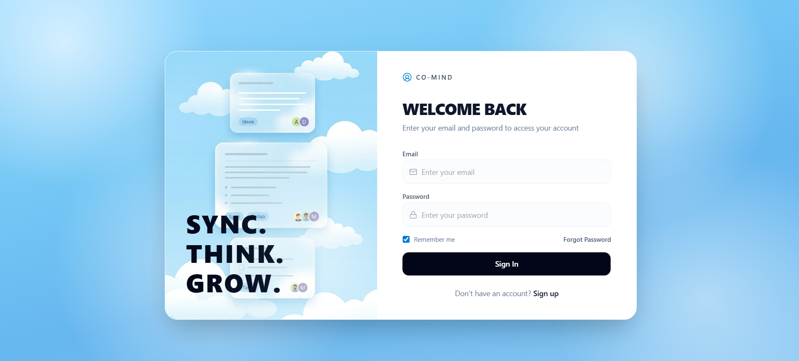
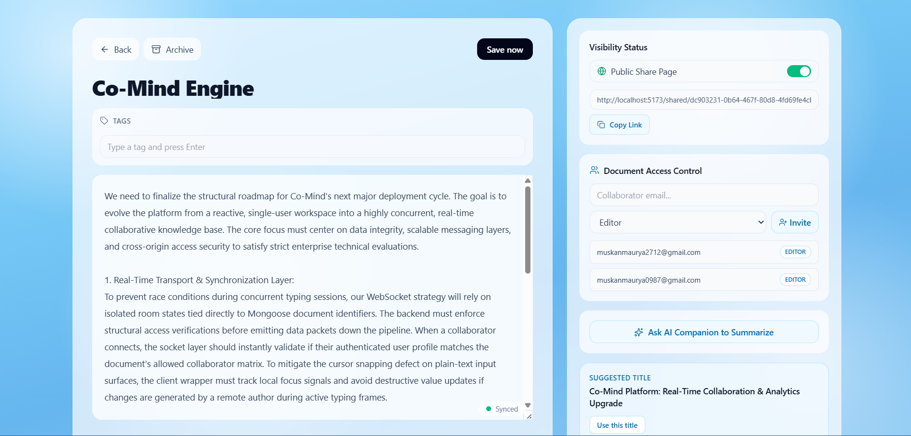
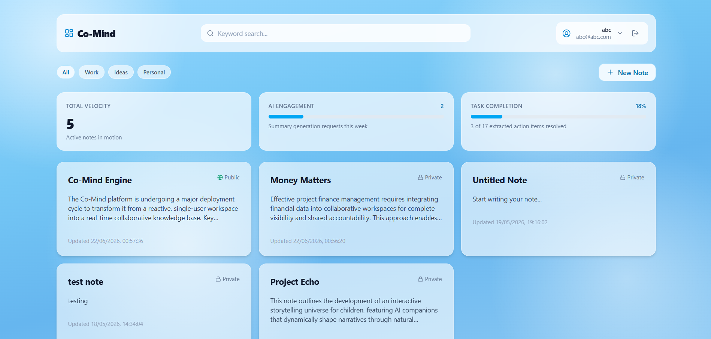

# Co-Mind

Co-Mind is an AI-powered collaborative notes application that supports real-time editing, collaborator invitations via email, and AI-generated summaries. This repo contains a Vite + React frontend and a Node.js + Express backend with Socket.io and MongoDB.

## Project Layout

- `Client/` — React + Vite frontend
- `Server/` — Node.js + Express backend, Socket.io, Mongoose models

## Screenshots

### Signup / Login View


### Invite Sent Confirmation


### Invite Failed Provider Error


### Note Editor & Realtime Collaboration


### Project Dashboard


---

## Quick Start (Local Development)

Prerequisites:
- Node.js 18+ and npm
- MongoDB (Atlas recommended) or a local MongoDB instance
- (Optional) Resend account for sending invitation emails

Server

1. Install dependencies and create a `.env` file under `Server/`:

```bash
cd Server
npm install
# create Server/.env and set required variables (see list below)
```

Required environment variables (Server/.env):
- `PORT` (default `8000`)
- `MONGO_URI` — MongoDB connection string
- `JWT_SECRET` — strong secret for signing tokens
- `CLIENT_ORIGINS` — comma-separated frontend origins (e.g. `http://localhost:5173`)
- `RESEND_API_KEY` — Resend API key (optional for email invites)
- `RESEND_EMAIL_ADDRESS` — sender email (must be a verified domain/email in Resend for production delivery)
- `GEMINI_API_KEY` — optional for AI features

Start server (choose whichever script your project uses):

```bash
# preferred for dev if available
npm run dev

# or
npm start
```

Client

1. Install dependencies and start the dev server:

```bash
cd Client
npm install
npm run dev
```

2. Configure client environment (optional):
- `Client/.env` or Vite envs: `VITE_API_BASE` (defaults to `http://localhost:8000`)

Open the app at the Vite URL (usually `http://localhost:5173`).

---

**API examples**

Signup:

```bash
curl -X POST http://localhost:8000/auth/signup \
  -H "Content-Type: application/json" \
  -d '{"name":"Alice","email":"alice@example.com","password":"SecretPass"}'
```

Login:

```bash
curl -X POST http://localhost:8000/auth/login \
  -H "Content-Type: application/json" \
  -d '{"email":"alice@example.com","password":"SecretPass"}'
```

Invite a collaborator (requires a note id and an Authorization header):

```bash
curl -X POST http://localhost:8000/notes/<NOTE_ID>/invite \
  -H "Content-Type: application/json" \
  -H "Authorization: Bearer <TOKEN>" \
  -d '{"email":"collab@example.com","role":"editor"}'
```

---

**Resend / Email delivery notes**

- During initial testing Resend may be in sandbox mode and will only allow sending emails to verified addresses. If invites fail with a message like:

  "You can only send testing emails to your own email address... verify a domain at resend.com/domains"

  then perform these steps:
  1. Verify a domain in the Resend dashboard.
  2. Add the DNS records Resend provides and wait for verification.
  3. Set `RESEND_EMAIL_ADDRESS` in `Server/.env` to an address on the verified domain (e.g. `invites@yourdomain.com`).
  4. Restart your backend and retry sending invites.

- The application will persist an `invitation` record even if email delivery fails; however, Resend will reject sends to arbitrary recipients until the domain/sender are verified.

---

**Troubleshooting**

- "Failed to fetch" on auth calls: confirm the server is running on the expected port, `VITE_API_BASE` is correct, and `CLIENT_ORIGINS` contains your Vite origin (e.g. `http://localhost:5173`).
- If you see `JWT_SECRET missing` in server logs, set `JWT_SECRET` in `Server/.env`.

**Testing**

- Manual: create two accounts, create a note, invite another address, and verify collaboration via the editor and socket updates.
- Add integration tests for auth and notes endpoints when convenient.

---

**Structure & notes**

- `Server/src/models` — Mongoose models for users, notes, invitations
- `Server/src/controllers` — API controllers
- `Server/src/services` — Resend email service and AI integration
- `Client/src/pages` — Key React pages (Auth, Dashboard, Editor)
- `Client/src/hooks` — Custom hooks (e.g. `useToast`)

---

**Contributing**

1. Fork the repository
2. Create a feature branch
3. Open a pull request with screenshots and a short description

**License**

MIT (add `LICENSE` if you want to publish under this license)

---

If you want, I can also:
- Add `Server/.env.example` and `Client/.env.example` files listing required env vars (without secrets).
- Create a `docs/screenshots/` folder with placeholder images so you can replace them.

Tell me which of those you'd like and I will add them.
